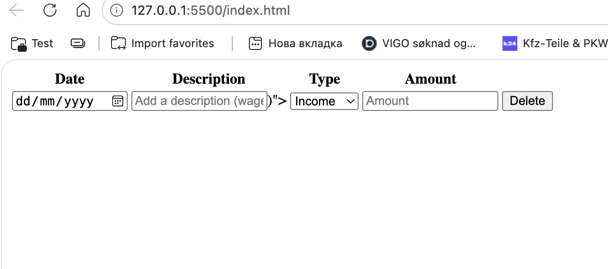

# kalkulator
Budsjettkalkulator

14sep 9.15 start research
9.22 asked copilot how to connect js to html via head, not body. (defer cmd in the end) 
9.28 La oss starte med å lage en enkel kalkulator i JavaScript
9.44 Jeg gjorde HTML for kalkulator
kjilde: https://poznayu.com/pishem-kalkulyator-na-javascript-i-html/
10:12 gjorde kalkulator med https://mate.academy/blog/tips/javascript-calculator
10:16 fant https://github.com/dtape1/budget-tracker som kjilde og skal bruke det som prototype. NEI, SKAL IKKE, NETTSIDE SKREVET MET CLAUDE OG JEG SKAL IKKE BRUKE DEN.
10:19 KJILDE: https://www.bing.com/videos/riverview/relatedvideo?q=%d1%8f%d0%ba+%d0%bd%d0%b0%d0%bf%d0%b8%d1%81%d0%b0%d1%82%d0%b8+%d0%b2%d0%b8%d1%82%d1%80%d0%b0%d1%82%d0%b8+%d0%b1%d1%8e%d0%b4%d0%b6%d0%b5%d1%82%d1%83+javascript&mid=DB568BB338B91909500EDB568BB338B91909500E&churl=https%3a%2f%2fwww.youtube.com%2fchannel%2fUCjX0FtIZBBVD3YoCcxnDC4g&FORM=VIRE

11:00 ferdig med HTML for budget tracker

jeg viste ikke resultatene fra CSS, så spørte jeg GPT hvorfor ser jeg ikke. Jeg gjorde feil med ":", skrev det ikke.

13:50 Startet med JS utvikling
12:50 Ferdig med JS 16sep